<!-- VISUAL STYLE CHECKPOINT: APPLE & OPENAI DESIGN SYSTEM -->
<!-- PALETTE: Background (#0F172A), Slate (#1E293B), Text (#F8FAFC), Muted (#94A3B8), Blue (#38BDF8), Purple (#8B5CF6) -->

  <!-- HERO BANNER -->
  

  <!-- TYPING TERMINAL -->
  

  <!-- ELEGANT Resume-style CONTACT HEADER -->
  

    Dehradun, India &nbsp;•&nbsp; 
    <a href="mailto:utkarsh.joshi.2423@gmail.com" style="color: #38BDF8; text-decoration: none;">utkarsh.joshi.2423@gmail.com</a> &nbsp;•&nbsp; 
    <a href="https://github.com/utkarshjoshi24" style="color: #8B5CF6; text-decoration: none;">github.com/utkarshjoshi24</a>
  

  

   

## 🪐 Profile Brief

<table border="0" cellpadding="0" cellspacing="0" width="100%">
  <tr>
    <td width="50%" align="center" style="border: none; padding: 6px;">
      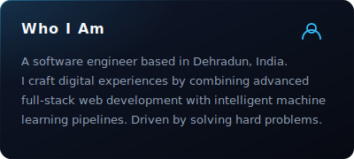
    </td>
    <td width="50%" align="center" style="border: none; padding: 6px;">
      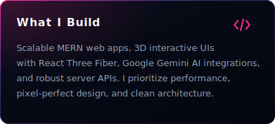
    </td>
  </tr>
  <tr>
    <td width="50%" align="center" style="border: none; padding: 6px;">
      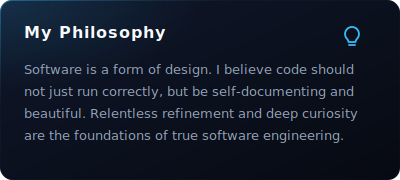
    </td>
    <td width="50%" align="center" style="border: none; padding: 6px;">
      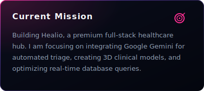
    </td>
  </tr>
  <tr>
    <td width="50%" align="center" style="border: none; padding: 6px;">
      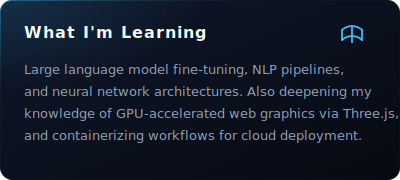
    </td>
    <td width="50%" align="center" style="border: none; padding: 6px;">
      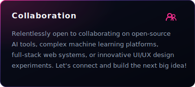
    </td>
  </tr>
</table>

   

## 🚀 Featured Engineering

Primary repositories showcasing full-stack systems, 3D web graphics, and machine learning pipelines:

 

<table border="0" cellpadding="0" cellspacing="0" width="100%">
  <tr>
    <td width="50%" align="center" style="border: none; padding: 6px;">
      <a href="https://github.com/utkarshjoshi24/Healio-">
        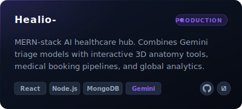
      </a>
    </td>
    <td width="50%" align="center" style="border: none; padding: 6px;">
      <a href="https://github.com/utkarshjoshi24/Shadow-Price--Smart-Subscription-Tracker">
        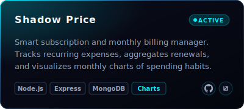
      </a>
    </td>
  </tr>
  <tr>
    <td width="50%" align="center" style="border: none; padding: 6px;">
      <a href="https://github.com/utkarshjoshi24/3d-Website-">
        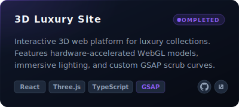
      </a>
    </td>
    <td width="50%" align="center" style="border: none; padding: 6px;">
      <a href="https://github.com/utkarshjoshi24/Email-Verifier">
        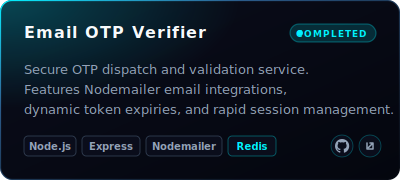
      </a>
    </td>
  </tr>
  <tr>
    <td width="50%" align="center" style="border: none; padding: 6px;">
      <a href="https://github.com/utkarshjoshi24/Machine-Learning-">
        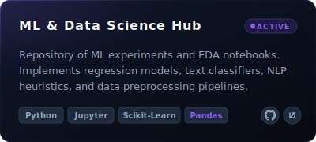
      </a>
    </td>
    <td width="50%" align="center" style="border: none; padding: 6px;">
      <a href="https://github.com/utkarshjoshi24/My-Portfolio-Website">
        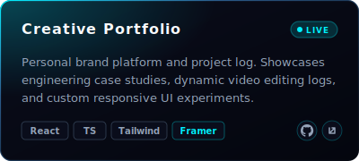
      </a>
    </td>
  </tr>
</table>

   

## ⚡ Current Focus

  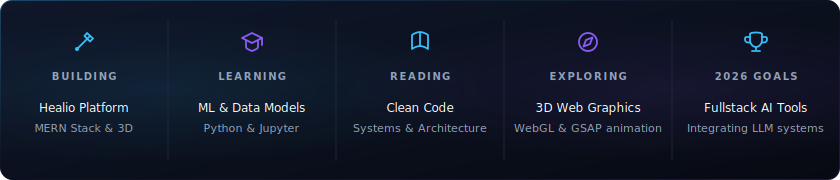

   

## 🛠️ Technology Stack

Curated technical pillars representing core competencies in production systems:

 

<table border="0" cellpadding="8" cellspacing="0" width="100%">
  <tr valign="top">
    <td width="33%" style="border: none; padding-right: 16px;">
      <h4 style="color: #38BDF8; font-family: -apple-system, sans-serif; font-size: 13px; font-weight: 700; letter-spacing: 1.5px; margin: 0 0 12px 0;">🧠 DATA SCIENCE &amp; ML</h4>
      

        • Python Programming 
        • Jupyter Notebooks 
        • Exploratory Data Analysis 
        • Dataset Transformations 
        • Pandas &amp; NumPy
      

    </td>
    <td width="34%" style="border: none; padding-right: 16px; padding-left: 16px;">
      <h4 style="color: #8B5CF6; font-family: -apple-system, sans-serif; font-size: 13px; font-weight: 700; letter-spacing: 1.5px; margin: 0 0 12px 0;">⚙️ FULL STACK SYSTEMS</h4>
      

        • JavaScript (ES6+) &amp; HTML/CSS 
        • TypeScript (WebGL) 
        • React.js Components 
        • Node.js &amp; Express APIs 
        • MongoDB Databases
      

    </td>
    <td width="33%" style="border: none; padding-left: 16px;">
      <h4 style="color: #38BDF8; font-family: -apple-system, sans-serif; font-size: 13px; font-weight: 700; letter-spacing: 1.5px; margin: 0 0 12px 0;">🔧 TOOLS &amp; APIS</h4>
      

        • Google Gemini API 
        • Git Version Control 
        • GitHub Repositories 
        • Vercel Deployments
      

    </td>
  </tr>
</table>

   

## 📊 GitHub Metrics Dashboard

An aggregated live view of codebase metrics, streaks, trophies, and development activity:

 

  <!-- TROPHY PANEL -->
  

 

<table border="0" cellpadding="0" cellspacing="0" width="100%">
  <tr>
    <td width="50%" align="center" style="border: none; padding: 4px;">
      
    </td>
    <td width="50%" align="center" style="border: none; padding: 4px;">
      
    </td>
  </tr>
  <tr>
    <td colspan="2" align="center" style="border: none; padding: 4px; padding-top: 12px;">
      
    </td>
  </tr>
</table>

   

## 🗺️ Developer Journey

  

   

## 🏆 Key Achievements

  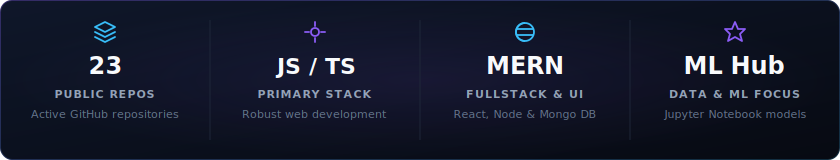

   

## 💡 Engineering Philosophy

  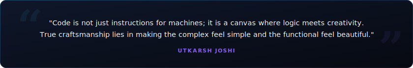

  

   

## 🤝 Let's Connect

  
  
  
  
  
  

  

  

<!-- FOOTER -->

  

